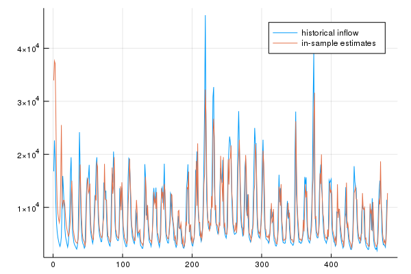

# Examples

## GARCH(1, 1)

GARCH (acronym for generalized autoregressive conditional heteroskedasticity) is a well-known time series model used to describe the conditional variance of the errors in time-varying fashion. In this example, we show how the GARCH(1, 1) is simply a particular case of GAS; more specifically, it is a Normal GAS(1, 1) model with inverse scaling.

Note that this equivalence is true only under no reparametrization -- it is necessary to modify the default `link!`, `unlink!` and `jacobian_link!` methods to use `IdentityLink` for the Normal distribution.

The code for this example can be accessed [here](https://github.com/LAMPSPUC/ScoreDrivenModels.jl/blob/master/examples/garch.jl).

## Water inflow

Let's model some monthly water inflow data from the Northeast of Brazil using a Lognormal GAS model. Since inflow is a highly seasonal phenomenon, we will utilize lags 1 and 12. The former aims to characterize the short-term evolution of the series, while the latter characterizes the seasonality. The full code is in the examples folder.

```julia
# Convert data to vector
y = Vector{Float64}(vec(inflow'))

# Specify model: here we use lag 1 for trend characterization and 
# lag 12 for seasonality characterization
gas = ScoreDrivenModel([1, 12], [1, 12], LogNormal, 0.0)

# Estimate the model via MLE
fit!(gas, y)

# Obtain in-sample estimates for the inflow
y_gas = fitted_mean(gas, y, dynamic_initial_params(y, gas))

# Compare observations and in-sample estimates
plot(y)
plot!(y_gas)
```

The result can be seen in the following plot.


